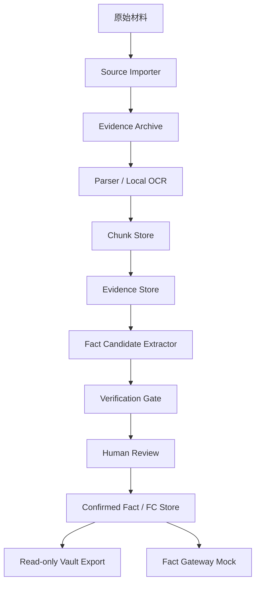

# 架构说明 v0.1

## 一、总体架构



## 二、事实权威

```text
SQLite = source of truth
Vault Markdown = read-only projection
Evidence archive = immutable source archive
```

所有写操作必须经应用服务层校验后写入 SQLite。Vault 只能由应用导出，不接受人工直接编辑。

## 三、存储结构

```text
storage/
  evidence_archive/
    SRC-YYYYMMDD-NNN/
      original/
      pages/
      extracted/
  vault_readonly/
    sources/
    facts/
    candidates/
    entities/
    requests/
    conflicts/
    audit/
  letai_factbase.sqlite3
```

## 四、OCR 链路

```text
扫描 PDF / 图片
→ 页面转图片
→ 图像预处理
→ 本地 OCR
→ 保存 text + bbox + confidence
→ 生成 evidence span
→ UI 高亮审核
```

OCR 识别出的事实默认不能直接成为 confirmed FC，必须人工确认。

## 五、Fact Gateway Mock

v0.1 不正式接入完整 subagent，只提供事实包接口：

- search_facts
- get_fact_by_id
- get_facts_by_entity
- get_facts_by_source
- get_facts_by_tag
- get_open_fr
- get_conflicts
- get_evidence_for_fact
- build_agent_context_pack

## 六、LLM 使用边界

- LLM 只处理 chunk。
- 每次调用记录 source_id、chunk_id、prompt_version、model 和输出。
- 敏感信息本地脱敏后再发给 LLM。
- LLM 只生成 FactCandidate。
- 无 API Key 时，系统仍可导入、解析、OCR、索引、人工查看。

