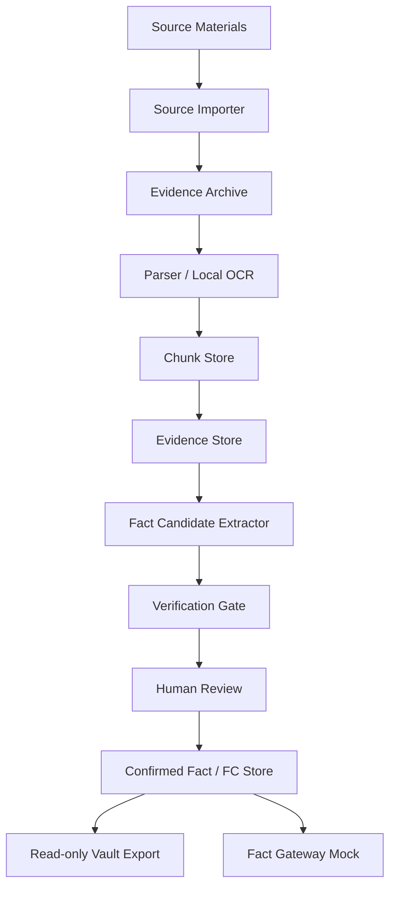

# Architecture v0.1

## 1. Overall Architecture



## 2. Factual Authority

```text
SQLite = source of truth
Vault Markdown = read-only projection
Evidence archive = immutable source archive
```

All writes must pass through application service-layer validation before reaching SQLite. Vault files are exported by the application and must not be manually edited.

## 3. Storage Structure

```text
storage/
  evidence_archive/
    SRC-YYYYMMDD-NNN/
      original/
      pages/
      extracted/
  vault_readonly/
    sources/
    facts/
    candidates/
    entities/
    requests/
    conflicts/
    audit/
  letai_factbase.sqlite3
```

## 4. OCR Flow

```text
Scanned PDF / image
-> render page image
-> image preprocessing
-> local OCR
-> save text + bbox + confidence
-> create evidence span
-> UI highlight review
```

Facts recognized through OCR cannot become confirmed FC records automatically. They must go through human confirmation.

## 5. Fact Gateway Mock

v0.1 does not formally integrate the full subagent workflow. It exposes fact-pack interfaces only:

- search_facts
- get_fact_by_id
- get_facts_by_entity
- get_facts_by_source
- get_facts_by_tag
- get_open_fr
- get_conflicts
- get_evidence_for_fact
- build_agent_context_pack

## 6. LLM Boundaries

- The LLM processes only chunks.
- Each call records source_id, chunk_id, prompt_version, model, and output.
- Sensitive information is redacted locally before the LLM call.
- The LLM may create only FactCandidate records.
- Without an API key, the system can still import, parse, OCR, index, and display materials for human review.
